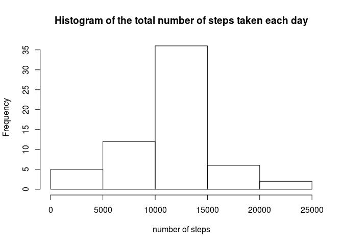

# Reproducible Research: Peer Assessment 1


## Loading and preprocessing the data

```r
dataset_filename = "/activity.csv"
dataset_path = paste(getwd(),dataset_filename,sep="")

# loading data from file
dt = read.csv(dataset_path)
```

## What is mean total number of steps taken per day?


```r
# summing up the total steps taken per day
tab = aggregate(dt[, 1], list(dt[,2]), sum, na.rm = TRUE)

hist(tab[,2], xlab = "number of steps", main = "Histogram of the total number of steps taken each day")
```

 

```r
# mean of the total number of steps taken per day
mean(tab[,2])
```

```
## [1] 9354.23
```

```r
# median of the total number of steps taken per day
median(tab[,2])
```

```
## [1] 10395
```

## What is the average daily activity pattern?

```r
tab = aggregate(dt[, 1], list(dt[ ,3]), mean, na.rm = T)

plot(tab[,1],tab[,2], type="l", xlab = "Intervals", ylab = "Average")
```

 

```r
# Interval with maximum number of steps
tab[which.max(tab[,2]),1]
```

```
## [1] 835
```

## Imputing missing values

```r
# Total number of missing values
sum(is.na(dt$steps))
```

```
## [1] 2304
```

```r
j = 1
for(i in tab[,1]){
  # Filling in with the mean for jth 5-minute interval
  dt$steps[is.na(dt$steps) & dt$interval == i] = tab[j,2]
  j = j + 1
}

# summing up the total steps taken per day
tab = aggregate(dt[,1], list(dt[,2]), sum, rm.na = TRUE)

hist(tab[,2], xlab = "number of steps", main = "Histogram of the total number of steps taken each day")
```

 

```r
# mean of the total number of steps taken per day
mean(tab[,2])
```

```
## [1] 10767.19
```

```r
# median of the total number of steps taken per day
median(tab[,2])
```

```
## [1] 10767.19
```

As one can note, the shape of two histograms change a little, especially for the number of steps below 15000. The median value became slightly different from the estimates from the first part of the assignment. However, the mean value increase significantly. Hence, after imputing missing data, the total daily number of steps increase a little as one could expect.

## Are there differences in activity patterns between weekdays and weekends?


```r
library (lattice)

w = weekdays.POSIXt(as.POSIXct(dt$date))

# it must change to your language
weekend = w == 'sábado' | w == 'domingo'

w[weekend] = "weekend"
w[!weekend] = "weekday"

tab = aggregate(dt[, 1], list(w, dt[,3]), mean )

xyplot(x ~ Group.2 | Group.1, data = tab, type="l"  ,xlab = "Interval", ylab = "Number of steps", layout=c(1,2))
```

 
